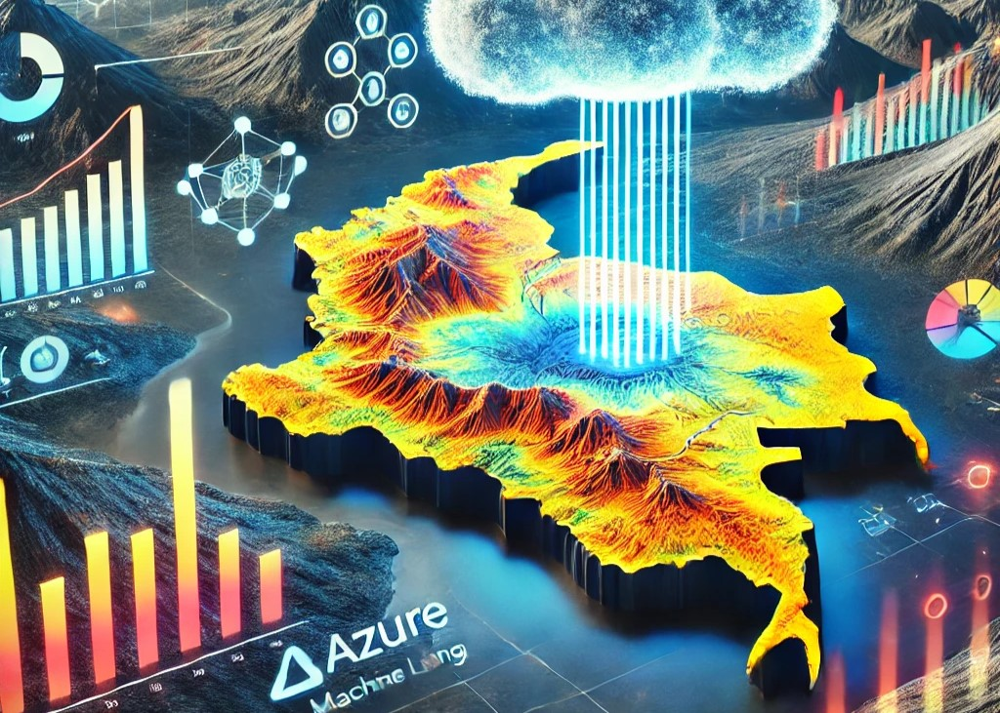

# Azure Machine Learning Workshop



Welcome to the Azure Machine Learning Workshop! In this session, you’ll embark on a hands-on journey to create and deploy machine learning models, with a special focus on geoscience applications. Using Azure Machine Learning's Designer, AutoML, and Notebooks, you’ll build models from the ground up, concentrating on practical geoscience scenarios.

This workshop is structured to provide clear, step-by-step guidance. Follow these instructions closely to maximize your learning experience.

**Estimated Time to Complete:** 1 to 2 hours

Rest assured, every step of the exercise is carefully laid out to support your progress.

## Use Case: Predicting Geothermal Characteristics in Colombia

### Objectives

The primary objective of this project is to predict geothermal characteristics in Colombia, with a particular focus on estimating the geothermal gradient. By leveraging machine learning techniques, you’ll aim to predict the Apparent Geothermal Gradient (°C/Km), which is crucial for geothermal exploration.

### Methodology

This project utilizes a blend of geospatial data, geophysical information, and geothermal measurements. The data, found in `normalized_data_minimax.csv`, includes details such as well depths, temperatures, geological features, and proximity to volcanic structures.

### Dataset Overview

The dataset used in this project is normalized, ensuring that all features have been scaled to a similar range, which is crucial for effective machine learning model training. Each column in the dataset is explained below:

1. **Latitude**: Specifies the north-south position of a point on the Earth's surface in degrees.
2. **Longitude**: Specifies the east-west position of a point on the Earth's surface in degrees.
3. **Elevation (m)**: The height of a point above sea level, measured in meters.
4. **Surface Temperature (°C)**: The temperature at the Earth's surface at a specific location, measured in degrees Celsius.
5. **Apparent Geothermal Gradient (°C/Km)**: The rate of temperature increase with depth beneath the Earth's surface, expressed in degrees Celsius per kilometer.
6. **Moho Depth (m)**: The depth to the Mohorovičić discontinuity, the boundary between the Earth's crust and the mantle, measured in meters.
7. **Magnetic Anomaly (nT)**: The deviation of the Earth's magnetic field from the expected value, measured in nanoteslas (nT), indicating variations in the magnetic properties of underlying rocks.
8. **Fault**: Indicates the presence (1) or absence (0) of a fault at the location.
9. **Strike-slip Fault**: A fault type where the motion is predominantly horizontal along the fault line.
10. **Reverse or Thrust Fault**: A fault where one block moves upwards relative to another, typically associated with compressional forces.
11. **Lineament**: Linear features on the Earth's surface representing underlying geological structures such as faults or fractures.
12. **Right-lateral Fault**: A type of strike-slip fault where the opposite side of the fault moves to the right.
13. **Normal Fault**: A fault where one block moves downward relative to another, usually associated with extensional forces.
14. **Active Fault**: A fault that has recently been active and may be prone to future earthquakes.
15. **Curie Depth (Km)**: The depth at which magnetic minerals lose their permanent magnetism due to high temperatures, measured in kilometers.
16. **Vertical Gravity Gradient (E)**: The rate of change of the gravitational field with respect to height, measured in Eötvös units (E).
17. **Free Air Anomaly (mGal)**: The difference between measured gravity at a location and theoretical gravity, corrected for elevation, measured in milligals (mGal).
18. **Bouguer Anomaly (mGal)**: The difference between measured gravity and theoretical gravity after correcting for elevation and the mass of rocks above sea level, measured in milligals (mGal).
19. **Nearest Basement**: The depth to the basement rock beneath sedimentary deposits.
20. **Nearest Volcano**: The distance to the nearest volcano from the given location.
21. **Volcanic Domain**: Classification of the area based on its volcanic activity or history.
22. **Volcanic Weight**: A weighted score representing volcanic activity in the area, often used in risk assessment models.
23. **Gradient Weight**: A weighted value representing the influence of the geothermal gradient in predictive models.
24. **Sample Weight**: The weight assigned to each sample in a dataset, used in machine learning models to give varying importance to samples.

## Step-by-Step Guide

### 1. Clone the Repository

Start by cloning the repository to your local machine:

```sh
git clone https://github.com/GitHub-Nawatech-Lab/azureml-exercise.git
```

### 2. Upload to Azure Machine Learning
- **Sign in to Azure Portal**: Access the Azure Portal and log in with your credentials.
- **Create an Azure Machine Learning Workspace**: If you don’t have one already, follow the Azure Machine Learning documentation to set up a new workspace.
- **Upload the Repository**: Navigate to your workspace and upload the cloned repository.

### 3. Upload the Dataset to Data Assets
- Navigate to the Datasets section within your Azure Machine Learning workspace.
- Click on **+ Create Dataset** and select From local files.
- Upload the `normalized_data_minimax.csv` file located in the data folder of the cloned repository.
- Complete the dataset registration process by providing a name, description, and ensuring the correct format is selected for the data.

### 4. Using Designer
- **Create a New Pipeline**: Go to the Designer section in Azure Machine Learning Studio and initiate a new pipeline.
- **Drag and Drop Modules**: Utilize the drag-and-drop interface to add data input, data transformation, and machine learning modules.
- **Configure Modules**: Set up each module according to the specific requirements of the project.
- **Run the Pipeline**: After configuring the pipeline, execute it to train and evaluate your model.

### 5. Using AutoML
- **Create a New AutoML Experiment**: In Azure Machine Learning Studio, navigate to the Automated ML section and start a new experiment.
- **Select Dataset**: Choose the dataset you uploaded to Data Assets.
- **Configure Experiment**: Set the target column to the geothermal gradient and adjust other settings as necessary.
- **Run the Experiment**: Launch the AutoML experiment to automatically train and evaluate multiple models.

### 6. Using Notebooks
- **Install Necessary Libraries**: Open the terminal in Azure Machine Learning Studio and run the following command:
```sh
pip install -r requirements.txt
```
- **Open the Notebook**: In Azure Machine Learning Studio, open the `Model_V4.ipynb` notebook.
- **Run Cells**: Execute each cell to preprocess data, train the model, and evaluate the results.
- **Analyze Results**: Review the outputs and visualizations to assess the model's performance.
